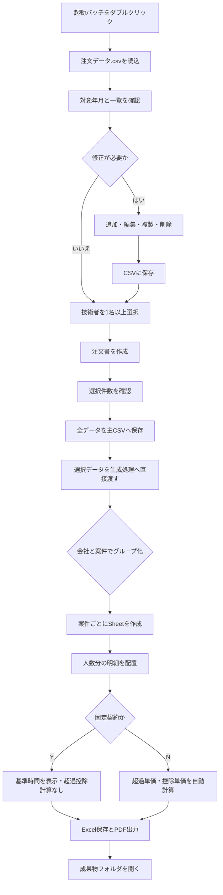

# 注文書作成ツール 技術仕様書

最終更新日: 2026-09-13

## 1. 本書の目的

本書は、CSVを主データとして管理し、画面で選択した技術者データから会社・案件単位のExcel注文書とPDFを作成するローカルツールの仕様、構成、操作方法、検証結果、および保守時の注意事項を記録するものです。

新しい作業セッションを開始する場合は、最初に本書を確認してください。

## 2. 現在の完成状態

以下の機能は実装済みです。

- CSVの対象年月と注文データを読み込む。
- ブラウザ上で注文データを一覧表示する。
- 会社、案件、技術者の追加、直接編集、削除を行う。
- 技術者の複製、選択、全選択、選択解除を行う。
- 案件行から、選択した技術者の複製または削除を行う。
- CSV保存前に入力内容を検証する。
- CSV保存時に、変更前のCSVを自動バックアップする。
- CSVへ全データを保存後、選択した技術者データだけをPowerShell生成処理へ直接渡す。
- 出力先フォルダを画面から選択する。
- 会社・案件・人数・契約種別に応じてExcelとPDFを生成する。
- 生成した成果物フォルダを画面から開く。
- ローカルWebサーバーを画面から終了する。
- 既存のExcel、PDF、成果物フォルダを削除しない。

## 3. ファイル構成

```text
注文書/
├─ 注文書ツール起動.bat          # 利用者がダブルクリックする起動ファイル
├─ 注文書Webサーバー.ps1         # ローカルWebサーバー、CSV入出力、生成処理の呼出し
├─ 注文書ツール非表示起動.vbs    # PowerShellを画面に出さずバックグラウンド起動
├─ 注文書作成.ps1                # Excel・PDF生成本体
├─ 注文書作成バッチ.bat          # 選択画面を開く互換起動ファイル
├─ 注文データ.csv                # 注文データ本体
├─ 注文書作成ツール_技術仕様書.md # 本書
├─ web/
│  ├─ index.html                 # 日本語画面
│  ├─ style.css                  # 画面デザイン
│  └─ app.js                     # 読込、編集、選択、検証、API呼出し
├─ template/
│  └─ 注文書テンプレート_統合.xlsx # 現在使用する統一テンプレート
├─ backup/                       # CSV保存時に自動作成されるバックアップ
└─ 成果物/                       # Excel・PDFの出力先
```

`test/` が存在する場合、その中身は開発・検証用の隔離コピーです。正式処理では使用しません。

## 4. 動作環境

- Windows
- Windows PowerShell
- Microsoft Excel デスクトップ版
- JavaScriptを実行できる一般的なブラウザ

利用者によるNode.js、Python、Webサーバー、データベースの追加インストールは不要です。JavaScriptはブラウザ内で実行されます。

## 5. 起動方法

利用者は `注文書ツール起動.bat` をダブルクリックします。

バッチは `%~dp0` を基準に、自分自身が置かれているフォルダを作業フォルダとして使用します。そのため、フォルダ一式を別の場所に移動しても、固定の絶対パスには依存しません。

バッチはWindows標準の `wscript.exe` と `注文書ツール非表示起動.vbs` を使用し、PowerShellサーバーを非表示で起動します。Windows Terminalが既定のターミナルであっても、サーバー用の黒い画面を開いたままにしません。

起動後、次のローカルアドレスをブラウザで開きます。

```text
http://127.0.0.1:4173/
```

同じツールがすでに起動している場合は、既存サーバーの識別情報と基準フォルダを確認してから、その画面を開きます。別のツールや別の注文書フォルダが同じポートを使用している場合は、誤った画面を開かずエラーを表示します。

## 6. 通常操作の流れ



「注文書を作成」を押すと選択件数、対象年月、出力先を確認します。確認後、現在の画面全体を主データCSVへ保存し、選択した技術者のデータだけを生成処理へ直接渡します。`注文書作成.ps1` はCSVを読みません。

## 7. CSV仕様

### 7.1 基本形式

対象年月はCSVの先頭で一度だけ指定します。各データ行に対象年月を繰り返し入力しません。

```csv
対象年月,2026-10

宛先会社名,出力フォルダ名,業務内容,工程範囲,技術者名,単価,固定契約,下限時間,上限時間,弊社責任者,備考
```

### 7.2 列定義

| 列名 | 必須 | 内容 |
|---|---:|---|
| 宛先会社名 | 必須 | 注文書の宛先会社名。出力ファイル名にも使用する。 |
| 出力フォルダ名 | 任意 | 会社ごとの成果物フォルダ名。同じ会社では最初の行だけ入力し、後続行は空欄でもよい。 |
| 業務内容 | 必須 | 案件名およびSheet名の基準。同一会社・同一業務内容は同じSheetにまとめる。 |
| 工程範囲 | 必須 | 注文書に表示する工程範囲。 |
| 技術者名 | 必須 | 技術者名。 |
| 単価 | 必須 | 基本単価。途中に空白やタブを入れない。 |
| 固定契約 | 必須 | `Y` は固定契約、`N` は時間精算。 |
| 下限時間 | 必須 | 基準時間の下限。固定契約でも入力する。 |
| 上限時間 | 必須 | 基準時間の上限。固定契約でも入力する。 |
| 弊社責任者 | 必須 | 注文書の担当者および弊社責任者欄に使用する。 |
| 備考 | 任意 | 注文書最下部の備考欄に使用する。 |

### 7.3 管理キー

CSVに専用ID列は追加せず、次の名称を階層型の管理キーとして扱います。

- 会社キー: `宛先会社名`。CSV全体で会社を識別する。
- 案件キー: `宛先会社名 + 業務内容`。同一会社内で案件を識別する。
- 技術者キー: `宛先会社名 + 業務内容 + 技術者名`。同一案件内で技術者レコードを識別する。
- キーの比較時は前後空白を除き、日本語ロケールで大文字・小文字を区別しない。
- 会社キーまたは案件キーを変更した場合は、所属する全レコードへ連動して反映する。
- 既存キーと重複する名称への変更は拒否し、変更前の名称へ戻す。

### 7.4 グループ化

グループ化の判定順序は次のとおりです。

1. `宛先会社名` で会社を判定する。
2. 同じ会社内で `業務内容` を案件名として判定する。
3. 同じ会社かつ同じ業務内容の技術者は、同じSheet内に人数分配置する。
4. 同じ会社でも業務内容が異なる場合は、別Sheetを作成する。
5. Sheet名は業務内容を基準に作成する。

同一会社・同一業務内容では、工程範囲、弊社責任者、備考を統一する必要があります。

### 7.5 契約種別

#### 固定契約 `Y`

- 下限時間と上限時間を基準時間として表示する。
- 超過単価および控除単価の計算行は使用しない。
- 固定契約用の説明文を表示する。

#### 時間精算 `N`

- 基本時間を表示する。
- 超過単価は `単価 ÷ 上限時間` を10円単位で切り捨てる。
- 控除単価は `単価 ÷ 下限時間` を10円単位で切り捨て、負数で表示する。

例：単価510,000円、下限149時間、上限200時間の場合

```text
超過単価 = 510,000 ÷ 200 → 2,550円
控除単価 = 510,000 ÷ 149 → 3,420円 → -3,420円
```

## 8. 日付仕様

- 起動時の `対象年月` は主CSVから読み込み、生成時は画面の値を生成データとして直接渡す。
- 本機の現在日時から対象年月を自動決定しない。
- 注文書の期間は対象年月の1日から末日までとする。
- 発注日は対象年月の前月末日とする。

例：対象年月が `2026-10` の場合

```text
期間   : 2026年10月1日 ～ 2026年10月31日
発注日 : 2026年9月30日
```

## 9. 出力仕様

### 9.1 月フォルダ

成果物は次の形式で保存します。

```text
成果物/2026年10月/
```

同じ対象年月を再生成した場合は既存フォルダを上書きせず、次の形式で新規作成します。

```text
成果物/2026年10月（2）/
成果物/2026年10月（3）/
```

### 9.2 会社フォルダとファイル

```text
成果物/2026年10月/任意の出力フォルダ名/
├─ 会社名様向け注文書_202610.xlsx
└─ 会社名様向け注文書_202610.pdf
```

会社フォルダ名はCSVの `出力フォルダ名` で指定できます。空欄の場合は `宛先会社名` を使用します。

Windowsで使用できない記号は安全な文字へ変換します。異なる会社のフォルダ名が変換後に同じ名前になる場合は、CSV保存前にエラーとします。

### 9.3 PDF

- 会社ごとに一つのPDFを作成する。
- 複数案件はExcel内で複数Sheetになる。
- PDFには作成対象のSheetをすべて含める。
- 人数に応じて行、印刷範囲、改ページ、担当者、備考、合計欄を動的に調整する。

## 10. Web画面機能

画面は、Windowsで使う中立的な企業向け業務システムを基準とし、濃紺の主操作領域と白い編集領域を使用した台帳形式です。過度な角丸、半透明、カプセル型ボタン、押下時の縮小表現は使用しません。内容領域の先頭行には対象年月、会社数、案件数、技術者数、会社追加だけを表示し、その直下から会社、案件、技術者の順に編集内容を表示します。各入力項目はラベルを入力枠の左側へ直接配置します。会社名と保存先は同じ行へ表示します。案件共通情報の第一行は案件名、工程、担当者の三列を等幅で表示し、第二行は備考だけを全幅で表示します。画面幅や文章量に応じて項目単位で折り返します。編集領域は一つの平面として表示し、注文領域、会社、案件、技術者表を複数の外枠で囲みません。会社、案件、技術者は24px単位で段階的に右へインデントし、各階層の開始位置へ太い縦罫線と控えめな内側シャドウを表示して、書籍の見出しのように所属関係を示します。新しい案件の開始位置は5px、新しい会社の開始位置は8pxの横罫線とシャドウで区切ります。技術者明細ではセルの罫線を入力境界として使用し、入力欄と選択欄に常設の内側枠を表示しません。フォーカス中の項目だけ青い編集枠を表示します。技術者は高さを統一した明細行として表示します。単価は画面上で3桁区切りのカンマを表示し、保存と計算では数値として扱います。同じ階層の操作ボタンは寸法を統一し、会社追加、案件追加、技術者追加をそれぞれ対象領域の右側に配置します。削除は対応する追加操作と同じ領域に置き、色で危険操作を区別します。ブラウザを拡大した場合は上部操作と共通情報を折り返し、技術者明細の横スクロールを各案件領域内に限定します。

表示階層は次のとおりです。

```text
会社領域
├─ 会社共通情報
└─ 案件領域
   ├─ 案件共通情報
   └─ 技術者明細表
      ├─ 技術者行
      └─ 技術者行
```

### 10.1 読込と編集

- 起動時に正式な `注文データ.csv` を読み込む。
- 起動直後は全会社を折りたたんで表示する。
- `再読込` は、現在の会社・案件の展開状態を維持したまま主CSVを読み直す。
- 対象年月、件数、会社追加・会社削除の行は画面上部へ固定し、一覧をスクロールしても表示を維持する。
- 会社ごとに領域を分け、その中へ会社情報と案件一覧を表示する。
- 会社情報には会社名と出力フォルダ名を横並びで表示する。
- 案件情報には業務内容、弊社責任者、工程範囲、備考を横並びで表示する。
- 案件ごとの技術者明細表は、技術者、単価、契約、基準時間、超過単価、控除単価の順に表示し、各列の内容を中央揃えにする。
- 技術者明細には技術者名、単価、契約種別、基準時間、超過単価、控除単価を表示する。
- 工程範囲、弊社責任者、備考は主画面上で省略せず、必要に応じて複数行表示する。
- 会社名と出力フォルダ名は、会社欄の入力項目を直接変更する。同じ会社の技術者行には重複表示しない。
- 業務内容、工程範囲、弊社責任者、備考は、案件欄の入力項目を直接変更する。同じ案件の全レコードへ反映し、技術者行には重複表示しない。
- 技術者名、単価、契約種別、下限時間、上限時間は各技術者行で直接変更する。
- 固定契約でも下限時間と上限時間は入力するが、画面上の超過・控除単価は計算しない。
- 新規追加と直接変更は、どちらも画面上部の一つの `変更を保存` ボタンでCSVへ反映する。
- 変更後は画面上部に `未更新` と表示する。
- 再読込時に未更新の変更がある場合は確認を表示する。
- ブラウザを閉じる場合も未更新警告を表示する。

### 10.2 追加と複製

- `会社を追加` は会社、最初の案件、最初の技術者の空欄を一覧へ追加し、その場で直接入力する。
- 上部固定行には、`会社を追加`、`会社を削除` の順で表示する。
- 各会社行の右端には、`案件を追加`、`案件を削除` の順で表示する。
- 会社行の `案件を追加` で、その会社へ新しい案件と最初の技術者の空欄を追加する。
- 案件行の操作順は、`複製`、`技術者を追加`、`技術者を削除` とする。
- 案件行の `技術者を追加` は、その案件へ技術者を一名追加する。
- 工程範囲、上下限時間、弊社責任者は既存データを初期値として補助入力する場合がある。
- 案件内の技術者を一名選択した場合は、その案件行の `複製` を使用できる。
- 複製は選択した技術者の契約条件を原レコードの直後へコピーし、技術者名を空欄にして一覧上で入力待ちにする。
- 同一案件内の同じ技術者名などの重複は、直接入力時または更新・作成前の入力検証で拒否する。

### 10.3 選択

- 会社のチェックボックスは、その会社に属する全技術者を選択する。
- 案件のチェックボックスは、その案件に属する全技術者を選択する。
- 技術者行のチェックボックスは、その技術者だけを選択する。
- 一覧上部のチェックボックスですべての技術者を選択できる。
- 一覧上部には `すべて選択` と `選択解除` を表示する。
- `選択解除` の後ろに `すべて折りたたむ`、`すべて展開` を表示し、会社・案件の階層表示を一括で切り替える。
- 選択件数は常時表示せず、`注文書を作成` を押した後の確認画面に表示する。
- 複製と技術者削除は各案件行の右側へ表示し、その案件内の選択状態に応じて有効化する。
- 会社削除は一つの会社全体を選択した場合、案件削除は一つの案件全体を選択した場合だけ有効化する。
- 出力先の選択ボタンと絶対パスは、一覧下部の `実行結果` 領域へ表示する。
- 出力先のフォルダ選択画面は別プロセスで開き、選択中もWebサーバーと画面操作を停止させない。

### 10.4 削除

- `会社を削除` は、その会社に属する案件と技術者を一覧から削除する。
- `案件を削除` は、その案件に属する技術者を一覧から削除する。会社の最後の案件を削除した場合は会社も一覧からなくなる。
- `技術者を削除` は、選択した技術者だけを一覧から削除する。
- 会社、案件、技術者の削除前に対象と件数を確認し、生成済みのExcel・PDFが削除されないことを明示する。
- 画面上で削除しただけではCSVに反映されない。
- `変更を保存` を押した時点で、追加、変更、削除をまとめてCSVへ反映する。
- 全行を削除した状態ではCSVを保存できない。
- 生成済みのExcel、PDF、成果物フォルダを削除する機能は存在しない。

### 10.5 入力エラー

主な検査内容は次のとおりです。

- 対象年月の形式
- 必須項目
- 単価の数値形式
- 単価内の空白またはタブ
- 固定契約のY/N
- 下限時間と上限時間の数値形式
- 下限時間が上限時間未満であること
- 同一会社・同一案件・同一技術者の重複
- 同一会社の出力フォルダ名の不一致
- 異なる会社の出力フォルダ名衝突
- 同一案件内の工程範囲、弊社責任者、備考の不一致

エラーがある場合は保存と生成を停止し、対象技術者行を赤色表示します。会社または案件の共通項目に問題がある場合は、対応する縦結合セルも赤色表示し、先頭エラーへ移動します。

## 11. CSVバックアップ

CSV保存時は、変更前のCSVを `backup/` に保存します。

```text
backup/注文データ_yyyyMMdd_HHmmss_fff.csv
```

保存は一時ファイルを作成後、元CSVとの置換とバックアップ作成を同時に行います。保存に失敗した場合、正式CSVを途中状態にしないことを目的としています。

現在の画面にはバックアップ復元ボタンはありません。復元が必要な場合は、対象バックアップの内容を確認した上で正式CSVへ戻してください。

## 12. ローカルサーバーと安全対策

- サーバーは `127.0.0.1` のみに接続する。
- 外部ネットワークには公開しない。
- Hostヘッダーを `127.0.0.1:4173` に限定する。
- 起動ごとにランダムな画面用トークンを作成する。
- 稼働確認用API以外のAPIは、CSV読込を含めて正しいトークンを要求する。
- POST要求のOriginを確認する。
- CSV保存、選択データ生成、出力先選択、成果物フォルダ表示はJSON形式のみ受け付ける。
- 出力先はWindowsのフォルダ選択画面で選ぶ。未選択時は `成果物/` を使用する。
- 成果物フォルダを開く場合は、サーバーが直前に生成した出力先と完全一致することを確認する。
- 任意のローカルファイルをWeb経由で取得できないよう、公開ファイルを限定する。

## 13. 文字コードと相対パス

- HTML、CSS、JavaScript、PowerShell、CSVはUTF-8を使用する。
- バッチファイルはUTF-8、CRLF改行で保存する。
- 起動バッチの先頭は次の形式を維持する。

```bat
:: コンソールをUTF-8に
chcp 65001 >nul
:: SQL*Plusのクライアント文字セットをUTF-8に
set NLS_LANG=Japanese_Japan.AL32UTF8
setlocal EnableDelayedExpansion
```

- バッチとPowerShell内で正式環境の絶対パスを記述しない。
- 基準フォルダはバッチ自身の場所から取得する。

## 14. テンプレート

現在の生成処理で使用する正式テンプレートは次の一つです。

```text
template/注文書テンプレート_統合.xlsx
```

固定契約用と時間精算用で別テンプレートを切り替えるのではなく、統一テンプレートの行構成、表示内容、数式を契約種別と人数に応じて変更します。

テンプレートの変更時は、見た目だけでなく、セル位置、ラベル検索、印刷範囲、改ページ、数式、結合セルに影響がないか確認してください。

Excelファイルを読み取り、検査、変換する場合は、最初に次のローカルOfficeCLIを使用してください。

```text
C:/Working/knowledge/OfficeCLI
```

OfficeCLIで対応できない場合のみ、理由を記録して別の方法を使用します。

## 15. 実施済み検証

以下は隔離したテスト用コピーで実施済みです。

- 起動バッチのダブルクリック相当実行
- 別フォルダへ移動した状態での相対パス起動
- 正式CSV形式の読込
- CSV編集内容の保存
- 保存前バックアップの作成
- 不正データ保存の拒否
- 空CSV保存の拒否
- 選択した2名だけが生成処理へ渡されること
- 0名選択の生成要求が拒否されること
- 選択データ生成時に主CSVのSHA-256が変化しないこと
- 選択した出力先が生成処理へ渡されること
- トークンなしAPI要求の拒否
- 不正Origin要求の拒否
- 直前に生成した成果物以外のフォルダを開く要求の拒否
- 安全化後に同名になる会社フォルダの拒否
- Excel・PDF一括生成
- 3会社分のExcel 3ファイル、PDF 3ファイルの生成確認
- OfficeCLIによる生成ExcelのOpenXML検証
- PDFのページ数、読込、PNGレンダリング、目視確認
- JavaScript構文検査
- PowerShell構文検査
- バッチのCRLF確認
- 絶対パスが残っていないことの確認
- 生成・起動スクリプトにファイル削除処理がないことの確認
- subagentによる全体機能と操作安全性の独立レビュー

正式な `注文データ.csv` と既存成果物は、Webツール開発の隔離テストでは変更していません。

## 16. 保守時の注意事項

### 必ず守ること

1. 既存成果物を削除する処理を追加しない。
2. 同じ対象年月の再生成では既存フォルダを上書きしない。
3. パスはバッチまたはスクリプトの所在を基準とする。
4. CSVの対象年月を本機日時で自動上書きしない。
5. 会社・案件・技術者の重複検査を維持する。
6. 固定契約でも下限時間と上限時間を必須とする。
7. Excelの確認にはOfficeCLIを最初に使用する。
8. 正式CSVを使った破壊的テストを行わない。テスト用コピーを作成する。
9. Web画面とサーバーの両方で入力を検証する。
10. バッチを編集した後はUTF-8・CRLFを再確認する。

### 現在の制約

- 会社内の案件識別は `業務内容` の文字列に依存する。同じ文字列は同一案件として扱う。
- 同じ案件名でも別案件として扱う必要が生じた場合は、将来CSVへ案件ID列を追加する。
- 別ブラウザタブや外部エディタとの同時編集を検出する楽観ロックは未実装。
- CSVバックアップを画面から復元する機能は未実装。
- 特に長い備考は、Excel上の備考欄の高さ上限に達する可能性がある。
- Excelの異常終了時、まれにExcelプロセスが残る可能性がある。

## 17. 次回セッションで最初に確認する項目

1. 本書を読む。
2. `注文データ.csv` の現在内容を確認する。
3. `注文書作成.ps1`、`注文書Webサーバー.ps1`、`web/app.js` の最新状態を確認する。
4. 正式環境に変更を加える前に、テスト用フォルダを作成する。
5. Excelを扱う場合はOfficeCLIを先に使用する。
6. 変更後は起動、読込、保存、バックアップ、生成、Excel、PDF、安全性を再検証する。
7. 最後にsubagentへ全体レビューを依頼する。

## 18. 主要処理の責任範囲

| ファイル | 責任範囲 |
|---|---|
| `web/index.html` | 日本語画面の構造と操作ボタン |
| `web/style.css` | 単一一覧の階層、入力項目、選択状態、エラー表示などの画面表現 |
| `web/app.js` | 画面状態、会社・案件・技術者のCRUD、選択、クライアント検証、選択データ送信、API通信 |
| `注文書Webサーバー.ps1` | ローカルHTTP、認証、主CSV読込・保存・バックアップ、選択データ検証、出力先選択、生成呼出し |
| `注文書作成.ps1` | 受信データからのテンプレート複製、会社・案件グループ化、行構成、数式、印刷、Excel・PDF出力 |
| `注文書ツール起動.bat` | 利用者向けWeb画面起動 |
| `注文書作成バッチ.bat` | 選択画面を開くための互換起動。CSVからの直接生成は行わない |

## 19. 終了方法

画面右上の `終了` を押すと、ローカルWebサーバーを終了します。未保存変更がある場合は確認を表示します。

ブラウザ画面だけを閉じた場合、サーバーが残ることがあります。その場合は再度起動バッチをダブルクリックすると、同じ注文書フォルダの既存サーバーを確認して画面を開きます。
